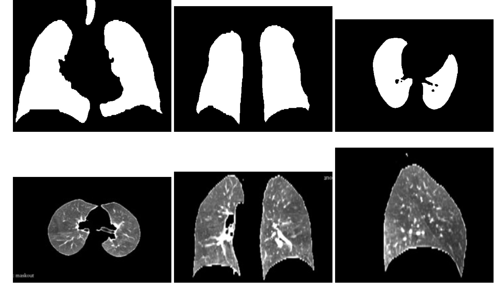
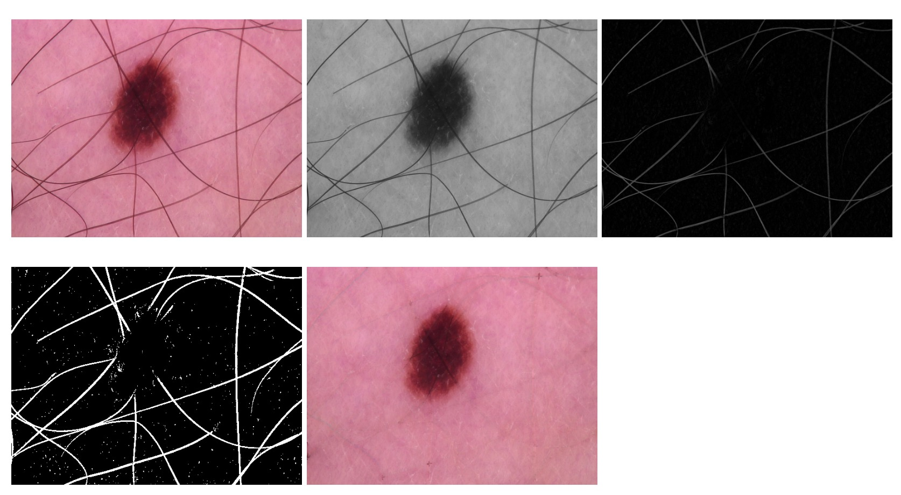
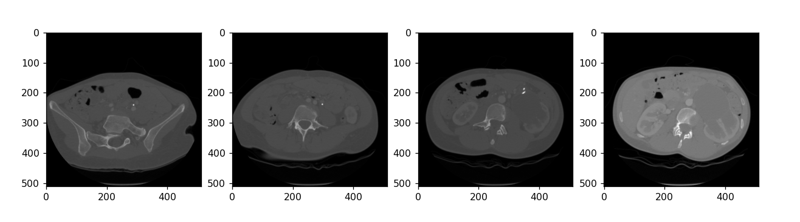
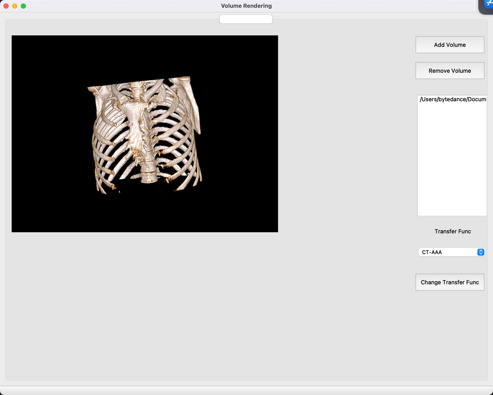
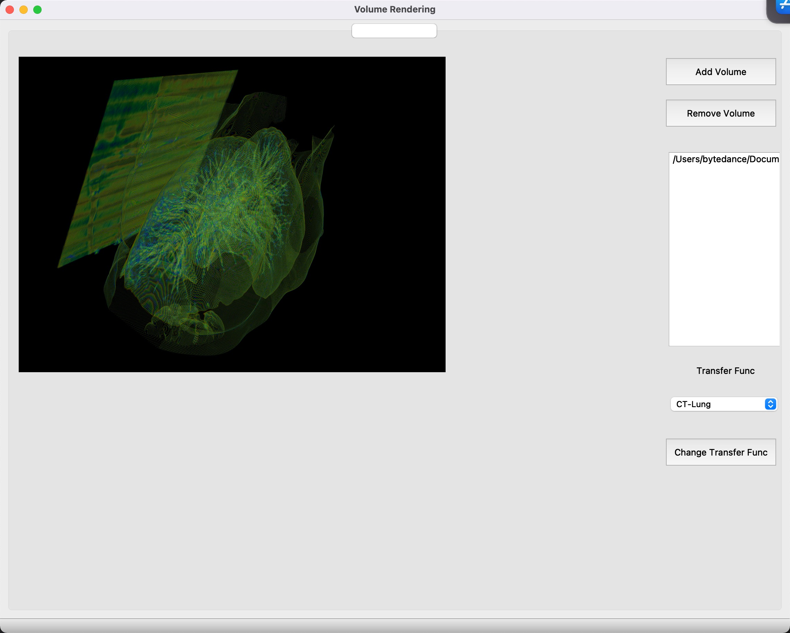

# MedicalImageScriptDemo
## Description
Some simple medical image processing python script. Wish these code can help you.

[Chinese Blog](https://www.cnblogs.com/WAoyu/tag/%E5%8C%BB%E5%AD%A6%E5%BD%B1%E5%83%8F/)

## Category
### 1. raw2mha
Raw volume data to mha format.
### 2. mha2jpg
Mha volume data to jpg slice. 
### 3. resample
Resample volume to specified physical size.

### 4. lungSeg
Use traditional image processing method to get lung mask from thoracic volume.



### 5. hairRemoval
Use traditional image processing to remove hair from skin image.



### 6. readDicom
Read dicom and visualization.



### 7. volumeRenderingQT
Volume rendering by using VTK, UI by using PyQT5




### 8. NiftyRegPythonWrapper
NiftyReg is a nice medical image registration tools, see: http://cmictig.cs.ucl.ac.uk/wiki/index.php/NiftyReg

Sometimes, we want to do batch operation, we can use python to control the process. I have already built a NiftyReg in windows platform, the bin files are in the win_bin.

## Useful resources

1. Use Deep learning method to segment lung, it is a good work can be directly used to your data. see: https://github.com/JoHof/lungmask

2. If you want to get some test data, you can see: https://www.dicomlibrary.com/ download dicom data, and convert to any format.

3. A very nice medical image processing,visualization software, ``3DSlicer``: https://www.slicer.org/

4. A nice biomedical imaging competition site, you can find a lot of medical dataset: https://grand-challenge.org/

5. If you work on thoracic volume (lung), you can use Dir-lab data: https://med.emory.edu/departments/radiation-oncology/research-laboratories/deformable-image-registration/index.html

6. If you study in medical image registration, for modern implement (auto-diff and GPU speed-up), use Air-lab: https://github.com/airlab-unibas/airlab

## Cite
If you think my work can help, you can cite my work. ♥️
```
@software{Aoyu_Medical_Image_Script,
  author = {Wang, Aoyu},
  month = {5},
  title = {{Medical Image Script Demo}},
  url = {https://github.com/MangoWAY/medicalImageScriptDemo},
  version = {0.1},
  year = {2022}
}

```